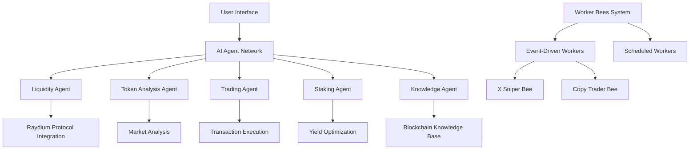

### Specialized AI Agent Network

[Rust Engineering in Blockchain & AI]

1.01^365 = 37.78 | 0.99^365 = 0.026

```mermaid
graph TD
    A[User Interface] --> B[AI Agent Network]
    B --> C[Liquidity Agent]
    B --> D[Token Analysis Agent]
    B --> E[Trading Agent]
    B --> F[Staking Agent]
    B --> G[Knowledge Agent]
    
    C --> H[Raydium Protocol Integration]
    D --> I[Market Analysis]
    E --> J[Transaction Execution]
    F --> K[Yield Optimization]
    G --> L[Blockchain Knowledge Base]
    
    M[Worker Bees System] --> N[Event-Driven Workers]
    M --> O[Scheduled Workers]
    N --> P[X Sniper Bee]
    N --> Q[Copy Trader Bee]
```
